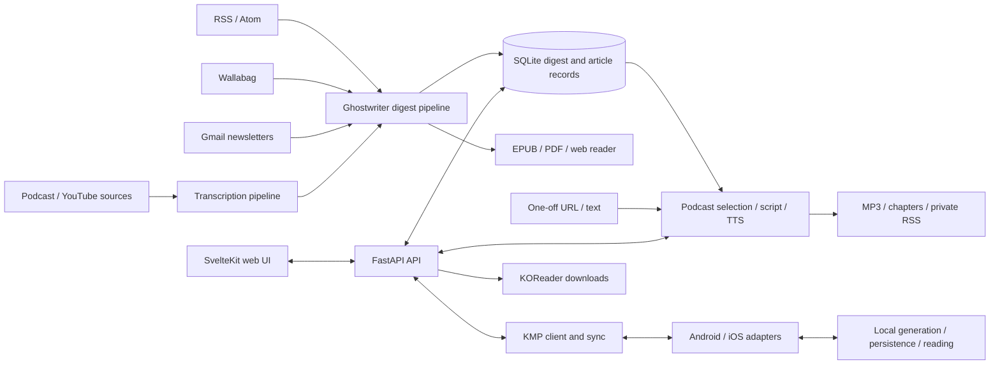

# Ghostwriter / Epilogue restart audit

**Audited:** 2026-09-27 · **Branch:** `main` · **Revision:** `cdb776d1d544bc6db0dd18a98cba1b9e86273f62`

This is a code and development-readiness audit of the local checkout, not a production certification. The working tree was clean at the start. No product fixes, deployments, real provider generation, or production-data inspection were performed. Findings refer to this revision and must be rechecked after changes.

## Executive assessment

This is an implemented personal publishing system with substantial capabilities, rather than an early scaffold. It converts a user's chosen information sources into finite reading digests and narrated listening material. Ghostwriter's backend and browser UI are the broadest product surface; Epilogue's native apps retain useful local reading/generation workflows but are not at feature parity with the server.

The evidence supports **stabilizing the current journeys before adding another major feature**. The most consequential weaknesses are in authentication request handling, data preservation during sync/cleanup, and edge cases in source ingestion. Build/type checks alone do not exercise those behaviors. Existing automated coverage is useful, but CI runs only a backend subset and omits browser, native, and shared-module tests.

The repository does not establish a current business strategy, target release, or approved next milestone. “Ghostwriter first, with optional native/e-reader clients” is the strongest inference from the current README, release activity, and implementation; it remains a decision for the owner.

Detailed evidence and verification are preserved in the component reports:

- [Backend, data, jobs, and security](audits/2026-09-27/backend.md)
- [Android, iOS, and shared KMP](audits/2026-09-27/mobile.md)
- [Web UI, KOReader, agent helper, CI, and release operations](audits/2026-09-27/web-ops.md)

## What the product does

### Purpose and vocabulary

The core user outcome is: **choose sources once, receive a useful edition, and consume it later on the device or player you prefer**. Full-content extraction supports focused reading; AI summarization reduces volume. EPUB and e-ink support make offline reading central rather than incidental. Generated audio expands the same source-selection workflow into listening.

There are two different podcast concepts in the code:

1. **Input podcasts:** subscribed third-party audio feeds transcribed into source material, alongside YouTube.
2. **Output podcasts:** Ghostwriter-generated narration of selected articles or one-off supplied material, published through a private RSS feed.

Similarly, **Fidelity / Briefing** in mobile UX correspond to full-content / summary behavior; backend feed configuration uses `raw` / `summarize`, and generated articles can report `summarized`. These are contract mappings to preserve, not names to casually standardize during unrelated work.

### Main journeys

| Journey | Implementation and practical boundary |
|---|---|
| Set up an installation | Docker/GHCR deployment, initial admin registration, web login, and per-user API tokens exist. Empty installations without a legacy key permit setup-mode API access. Bootstrap should precede exposure to untrusted traffic. |
| Build a reading edition | Add RSS/Atom feeds and processing preferences, trigger a digest or use schedules, observe processing, read in the browser or download EPUB/optional PDF. Deduplication, content filtering, cover generation, and fallback handling exist. |
| Include saved and subscribed content | Wallabag unread items, Gmail label-selected newsletters, and completed podcast/YouTube transcripts can contribute to digests. Source-only edge cases are broken; see findings. |
| Generate a listening edition | Select digest material, rank/filter using preferences and feedback, generate a solo or two-host script, synthesize audio through OpenAI or ElevenLabs, and expose episode status, retry, download, and RSS. |
| Generate a one-off podcast | Authenticated URL/text input becomes a hidden source digest and generated episode; the helper supports preview, polling, downloads, saved responses, and per-episode settings. This is a substantive current workflow, not merely a future idea. |
| Read locally on mobile | Android and iOS have native feed management, local digest generation/history/reader, persistence, and platform background scheduling. Ghostwriter integration and shared sync are present but gated differently and have correctness risks. |
| Read on an e-reader | KOReader plugin can be packaged with connection credentials, download new EPUBs, and prune older files. Its folder cleanup requires correction before being trusted with a mixed library. |

### Implementation maturity

- **Strongest breadth:** Ghostwriter backend + web. Existing flows include account/token setup, source management, digests, reader, media processing/retries, generated-podcast settings/episodes, logs, schedules, integration configuration, and plugin packaging.
- **Active recent direction:** local HEAD's newest work is podcast expressiveness, dialogue synthesis, length control, unique titles, and chapter markers. The latest local tag is `ghostwriter-v1.1.0`, but HEAD contains later work and migrations through `025`.
- **Native clients:** real independent applications, not thin web wrappers. That independence creates duplicated business logic and differing failure semantics. Generated-podcast native controls/playback and article feedback are not implemented across the native/shared contracts.
- **KMP migration:** meaningful shared networking and sync logic exists, but legacy Android Retrofit and native Swift fallback/adaptation paths remain. Do not infer all clients use one implementation just because a shared module exists.
- **No evidence for:** isolated multi-tenant hosting, a durable distributed job platform, uniform mobile parity, or a currently verified public production deployment.

## Architecture and important boundaries

### Components and change ownership

| Area | Main entry points | Engineering implications |
|---|---|---|
| API/auth/configuration | `ghostwriter/app/main.py`, `app/api/router.py`, `app/core/security.py`, `app/api/auth.py` | FastAPI lifecycle starts recovery and scheduling. Authentication is not equivalent to tenant isolation. |
| Persistence | `app/models/`, `app/core/database.py`, `alembic/versions/` | SQLite + SQLModel; Alembic is the schema-upgrade mechanism. `create_all()` only supplies missing tables. Current migration head is `025`. |
| Reading pipeline | `app/worker/bindery.py`, `services/content_processor.py`, `llm_service.py`, EPUB/PDF/cover services | Orchestrates fetching, filtering, extraction, enrichment, persistence, and delivery. Source gating and completion semantics matter. |
| Listening pipeline | `services/podcast_service.py`, `one_off_podcast_service.py`, `api/podcast.py` | Large central service spans preferences, article ranking, scripts, TTS, cost estimates, numbering, chapter metadata, and recovery. Split only around a concrete change with tests, not by aesthetic refactoring. |
| Scheduling/retention | `worker/scheduler.py`, `worker/media_pipeline.py`, `worker/cleanup.py`, `services/activity_tracker.py` | APScheduler/in-process async work and persisted job states. Inactivity can disable schedules; retention removes user artifacts. |
| Web | `frontend/src/lib/api/client.ts`, `src/lib/components/features/`, `src/routes/` | Static SvelteKit build served with backend; local development proxies API requests. Browser flows need more than compiler coverage. |
| Shared/native | `shared/src/commonMain/`, `app/src/main/`, `EpilogueIOS/App/`, `EpilogueIOS/Modules/` | Backend DTO and persistence changes can fan out across shared, legacy, and native paths. Assign explicit contract owners. |
| Delivery | Dockerfile, Compose, `entrypoint.sh`, `.github/workflows/`, `ghostwriter/RELEASE.md` | Startup migrates before Uvicorn. Published image and local-source deployment are different workflows. |

The selected tracked Python/Kotlin/Swift/Svelte/TypeScript/Lua files total roughly **87,000 lines**, including tests and support code: backend/web/integrations about 50,000; Android about 18,000; iOS about 15,500; shared about 2,400; helper about 1,500. This is large enough that one focused owner per component/interface is valuable.

### Data ownership and trust

Users, JWT login, hashed API tokens, and private podcast feed tokens exist. Regular feeds, regular digests, client configuration, Wallabag configuration, and much scheduling/activity state are installation-wide. Podcast preferences, episodes, and feedback have user-level ownership handling; one-off digest access receives additional protection. Treat this as a trusted self-hosted installation with mixed ownership boundaries, not a SaaS tenancy model.

Source content may leave the installation through configured LLM, TTS, transcription, and cover providers. Filesystem outputs, stored integration credentials, database backups, private RSS URLs, and preconfigured KOReader ZIPs all deserve explicit handling in any deployment work. Masking secrets in API responses is not encryption of their database representation.

### Job model and scaling

Digest and episode state is stored, but execution uses application-process scheduling/background tasks. Startup marks interrupted jobs failed rather than resuming a durable work queue. A second application worker can start duplicate schedulers or interfere with another worker's in-flight state. Current delivery should be treated as a single-application-process design unless worker coordination is deliberately introduced and verified.

## Priority findings

Priorities below are restart recommendations, not fixes already authorized or implemented. **P1** means address before relying on the affected exposed/data-mutating journey; **P2** means important hardening or completeness work. Static findings and runtime reproductions are distinguished in the linked reports.

| ID | Priority | Finding and consequence | Evidence / next acceptance criterion |
|---|---|---|---|
| R01 | P1 | Login/registration rate limiting is effectively disabled: the only calls sit after a return in token revocation. | `app/api/auth.py:347–348`; isolated login probe exceeds configured threshold without 429. Move checks to reachable auth entry points and test rejection/recovery. |
| R02 | P1 | `verify_api_key` obtains a session with `next(get_session())` without retaining/closing its generator/session reliably. Auth checks can retain checked-out DB connections until garbage collection. | `app/core/security.py:75`; isolated connection-pool probe. Use a managed dependency/context and prove release on success and failure. |
| R03 | P1 | KOReader retention selects all `.epub` files in the configured folder, including unrelated books. | `ghostwriter_sync.lua:35–67`; static destructive path. Restrict deletion to a manifest of plugin-owned artifacts and test a mixed directory. |
| R04 | P1 | Mobile feed synchronization pushes all local feeds before pulling, allowing an unchanged stale device to overwrite a newer web/server edit. | `shared/.../FeedSyncUseCase.kt:32,67–87` + backend `/feeds/sync`; add dirty-field/version conflict handling and two-client tests. |
| R05 | P1 | Digest generation can complete empty before non-RSS sources are considered: no active RSS exits early; no fresh article inputs exits before loading media transcripts. | `worker/bindery.py:206–212,415–421` versus later media load. Test Wallabag-only, newsletter-only, and transcript-only editions. |
| R06 | P1 | Android advances local feed watermarks before final EPUB/history persistence; iOS local generation lacks equivalent seen-item filtering. Failure can lose retry eligibility on Android; repeated editions can duplicate sources on iOS. | Mobile report's local-generation call traces. Commit watermark only with durable success; establish and test explicit retry/deduplication semantics. |
| R11 | P1 | Android EPUB filenames contain only the day and period, so repeated runs overwrite files referenced by older history entries; deleting an older entry can remove the newer output. | `app/.../service/EpubGenerator.kt:345–354`, `DigestRepository.kt:245–250`; static ownership trace. Use unique per-digest files and test repeated generation followed by deletion. |
| R07 | P2 | Mobile feed deletion is local-first with best-effort remote deletion and no durable pending tombstone, so offline deletions can reappear. | Mobile repository/service traces. Queue deletion intent and prove reconnect reconciliation. |
| R08 | P2 | Backend digest cleanup removes the parent row/EPUB but leaves related article rows and cached PDFs. | `worker/cleanup.py:45–80`; isolated retention probe. Define retention across rows/files/episode links and test all owned artifacts. |
| R09 | P1 | One-off helper attaches bearer credentials to server-supplied absolute download URLs and does not enforce redirect origin boundaries. | Helper transport reproduction with a fake token; see web/ops report. Restrict authenticated downloads/redirects to approved origin, with downgrade and cross-origin tests. |
| R10 | P2 | CI misses important implemented behavior: no native/shared checks, no browser E2E execution, and the backend smoke selection omits podcast API/service tests despite recent changes there. | `.github/workflows/ghostwriter-pr-check.yml`; define reliable, affected-surface checks rather than treating current green CI as full coverage. |

Additional actionable findings are in the appendices: invalid sync UUIDs yield HTTP 500; iOS combined sync can report success after swallowing ingestion failures; KOReader connection-dialog closures reference the wrong Lua binding; Playwright selectors still assume old navigation; and Python dependency declarations differ between `requirements.txt` and `pyproject.toml`.

These are focused findings, not a claim that every subsystem was exhaustively security-tested. In particular, no real provider quality, physical-device scheduling, or production recovery exercise was performed.

## Verification baseline

| Check | Actual result | Interpretation |
|---|---|---|
| Full backend pytest suite, temporary storage, `.env` disabled, outbound socket connections blocked | **243 passed, 1 failed**, 858 warnings, 11.54s | Failure was external DNS resolution in `test_sync_feeds`, not its business assertion. The suite was not unconditionally green. |
| Rerun only `test_sync_feeds` with deterministic `example.com` DNS injection | **1 passed, 243 deselected**, 0.16s | All 244 tests passed across the two executions, with one requiring an extra mock. Fix isolation before claiming reproducible clean runs. |
| Isolated backend probes | **Reproduced** connection retention, missing throttling, malformed-ID 500, article/PDF orphaning, and two media-only empty-digest cases | Disposable DB/files; no real provider/source traffic. Details and output in backend appendix. |
| Frontend `npm run check` | **Pass: 0 errors, 0 warnings** | Existing installed dependencies, Node 24.21.0. |
| Frontend `npm run build` | **Pass** | Static app build; an upstream unused-import warning remains. No browser journey proven by this. |
| Playwright core-route smoke | **Blocked before assertions** | Required Chromium headless-shell executable is not installed. Stale route expectations found by source inspection. |
| Helper preview / credential transport probes | **Preview passed; cross-origin bearer forwarding reproduced** | Synthetic sources and credentials; no actual network or account access. |
| Android + shared offline unit tests | **Blocked during Gradle configuration; zero tests ran** | AGP 8.2.2 unavailable in local offline cache after cache permission issue was resolved. |
| iOS simulator compilation, existing generated workspace, signing disabled | **Failed**: missing `URL.validHTTPURL` member | The helper source exists but is absent from the stale generated project. A fresh XCFramework/Tuist generation was not verified; this does not establish a current-source compile defect. No app/test launch. |
| Provider audio quality, real Gmail/Wallabag, device scheduling, clean container install/pull, deployment recovery | **Not run** | Separate acceptance work is needed for the chosen release scope. |

Backend collection initially failed because Mutagen was absent from both available Python environments. The declared Mutagen 1.47 package was installed only into a temporary audit dependency directory; no repo/global environment was modified. Existing backend tests cover fresh/unversioned bootstrap and selected migration paths, but do not establish every historical upgrade. The [backend appendix](audits/2026-09-27/backend.md) records the wrapper/environment and exact commands. The other appendices record their command results and temporary log locations.

No current green baseline has been established for the native apps. Existing generated artifacts and local dependency installations should not substitute for a clean-setup verification milestone.

## Documentation and repository-state drift

1. **Two product narratives remain.** Root/Ghostwriter READMEs now present Ghostwriter first; `CLAUDE.md` is largely Epilogue first. Treat narrative alignment as a product choice and keep the selected entry-point documentation consistent.
2. **Podcast requirements are historical.** `tasks/podcast-digests-requirements.md` discusses migration `014` and choices that later implementations have already made. Do not reimplement those items blindly. Some mobile gaps remain real.
3. **Release notes do not describe all of HEAD.** Runtime/package version is still `1.1.0`; the release notes describe head `021`, while current source includes `022–025` and later podcast work. Existing release notes accurately describe their release, but HEAD needs a new release inventory before shipping.
4. **Registry distribution is unverified here.** `ghostwriter/RELEASE.md` records a past unauthenticated GHCR pull failure. That is an unresolved historical concern, not evidence of today's registry visibility. Verify the intended pull policy during release preparation.
5. **`tasks/` is ignored by Git.** Local todo/lessons are useful in this checkout but do not provide portable project memory. Put the concise current state and lasting decisions in tracked docs; do not silently assume another worktree/clone has historical task notes.
6. **Native setup documentation needs reconciliation.** The README shortcut is less complete than the Makefile's KMP/XCFramework preparation path. Generated workspace presence does not prove a clean checkout builds.
7. **Dependency reproducibility is incomplete.** Python ranges, split dependency lists, and the unpinned runtime `yt-dlp` install mean the same commit need not produce the same environment over time. Fix declarations first; choose locking/update policy deliberately.

## Recommended restart sequence

### Milestone 1 — Make existing data and access paths dependable

Recommended first engineering milestone: address R01–R05 and R09 in small independently reviewable changes, with cleanup ownership and sync conflicts treated as separate workstreams. If native local generation is the immediate product priority, bring R06 and R11 into that milestone rather than broadening backend feature work.

Acceptance: reachable auth rate limits; bounded session lifetimes; no deletion outside plugin-owned files; stale devices preserve newer server edits; non-RSS-only editions generate from eligible content; and credentials never follow an unapproved download origin. Add behavioral regressions and demonstrate the combined result. This milestone does not require a UI redesign or new architecture.

### Milestone 2 — Establish repeatable release confidence

Reproduce backend tests and frontend check/build in a clean dependency environment, reconcile broken browser smoke assumptions, add high-value podcast and sync coverage to CI, and establish runnable Android/KMP and iOS baseline checks. Verify migrations from a fresh database and the latest released schema. Document the single-process runtime assumption and test backup/restore before a real upgrade.

Acceptance: every chosen release surface has named checks with observable results; blocked checks are resolved or explicitly excluded from the release scope; a pinned container can be pulled and smoke-tested under the intended access policy.

### Milestone 3 — Pick one end-to-end product outcome

Choose among improving the web reading edition, the narrated listening edition, or native/e-reader reliability. Specify one representative user's journey, success metric, and release target. Use that outcome to decide platform parity, UX work, and service refactoring. Avoid advancing all surfaces at once simply because the repository contains them.

Product decisions still needed:

- Who is the primary user, and which consumption surface should be excellent first?
- Is this a personal/trusted-household installation, or is stronger account isolation a future requirement?
- Which promise matters most next: reliable reading editions, high-quality generated podcasts, or native/offline experience?
- What is the desired next release and what real-device/provider validation is available for it?

These questions do not block the audit or prompt. They should guide the orchestrator's next planning conversation.

## Orchestration handoff

Use [the project orchestrator prompt](project-orchestrator-prompt.md) in the one chat you keep interacting with. Its job is to own decisions, bounded delegation, integration, verification, and durable state. [Project state](project-state.md) records this completed audit and the pending next product decision. No recurring automation or new chat is required to use the prompt.
